# 온톨로지 스키마 다이어그램

전체 스키마(클래스 138개, 객체속성 52개, 데이터속성 62개, 모듈 9개)의 시각화.
계층 다이어그램의 화살표는 **상위 분류 → 하위 분류**(`rdfs:subClassOf`의 역방향),
관계 다이어그램의 화살표는 객체속성이다. `《개체》`는 열거형 named individual.

## 1. 모듈 구조 (owl:imports)

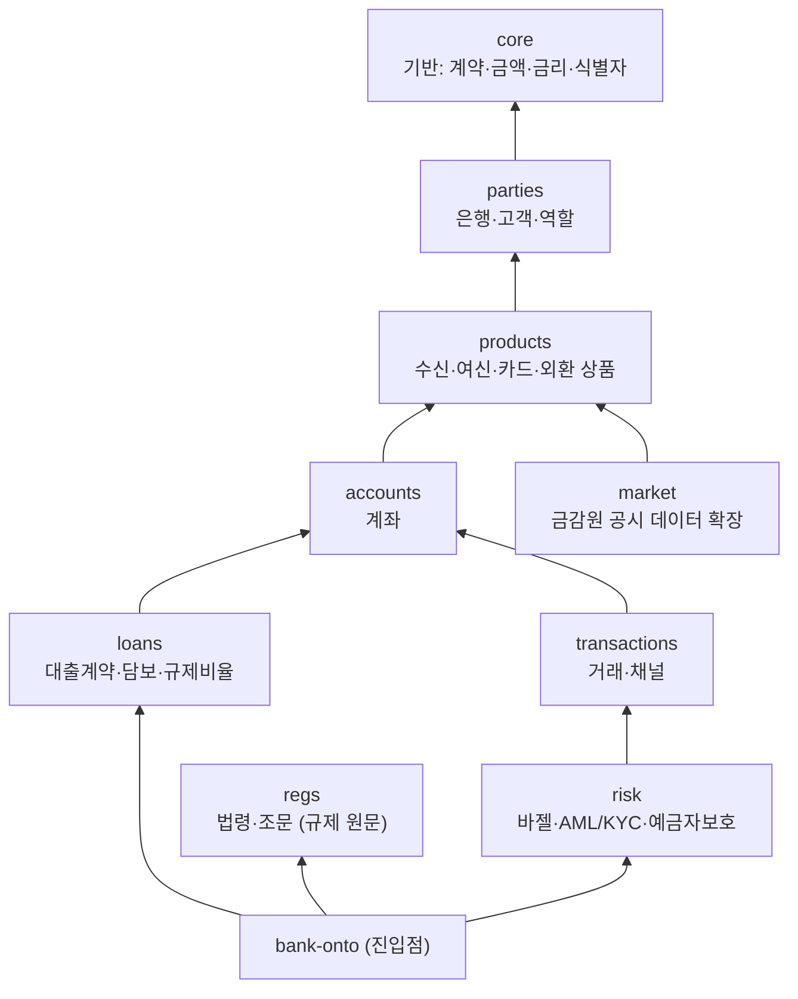

`market`은 `products`를 확장하는 데이터 모듈로, `bank-onto`의 직접 import 대상은 아니고
KB가 디렉터리 로드로 함께 적재한다. `regs`는 다른 모듈에 의존하지 않는 독립 모듈이다.

## 2. 핵심 개념 관계도 (모듈 횡단)

FIBO의 세 가지 축 — 당사자-역할 분리, 상품(템플릿)-계약(법률관계)-계좌(운영단위) 분리 —
가 어떻게 연결되는지 보여준다.

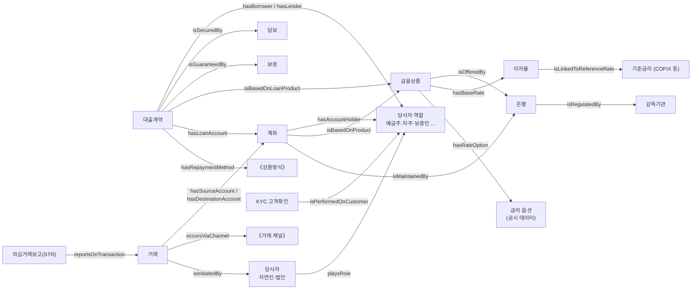

## 3. core — 기반 개념

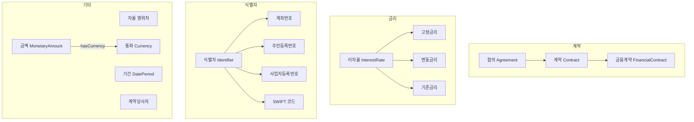

## 4. parties — 당사자와 역할

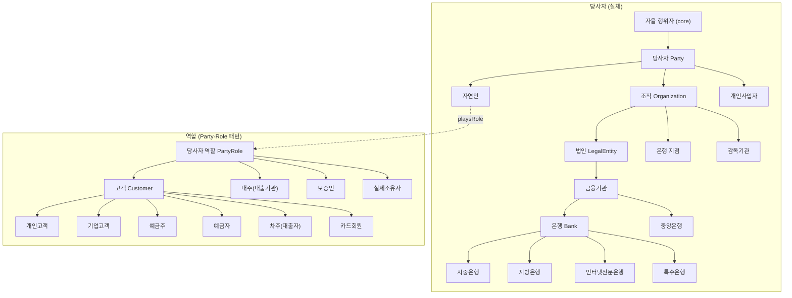

## 5. products — 금융상품

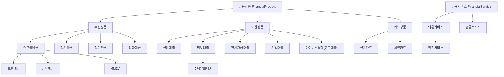

## 6. accounts — 계좌

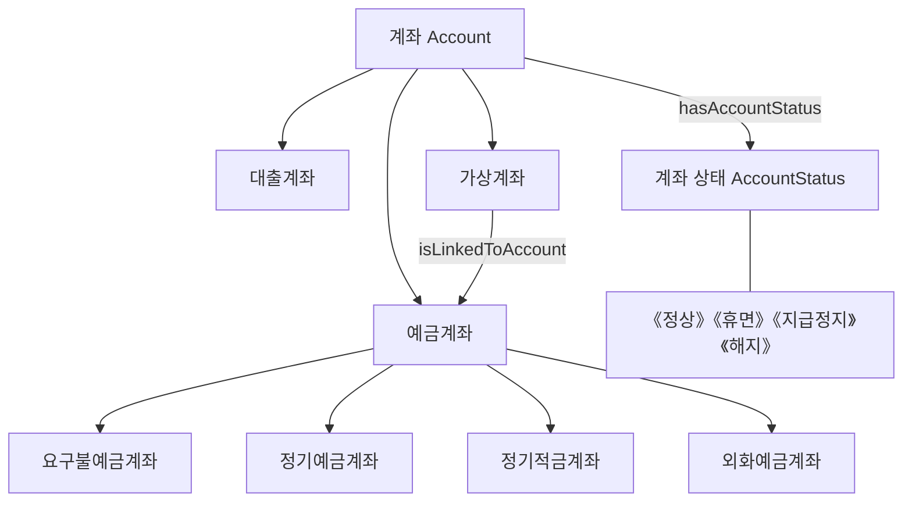

## 7. loans — 여신

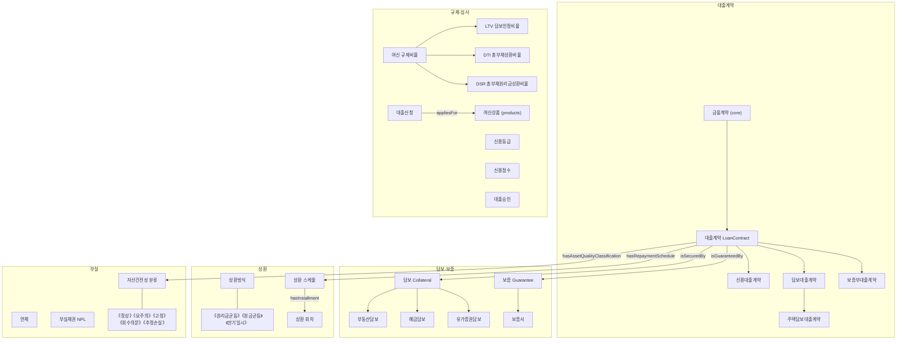

## 8. transactions — 거래

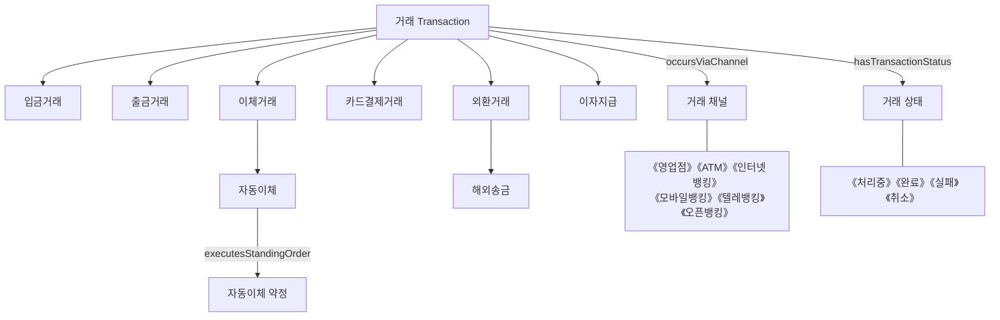

## 9. risk — 리스크·규제준수

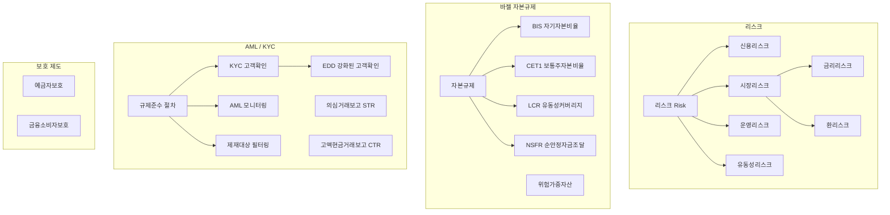

## 10. regs — 법령·조문 (규제 원문)

`data/law-instances.ttl`에 은행 관련 법령·조문 코퍼스가 이 스키마의 인스턴스로 적재된다.

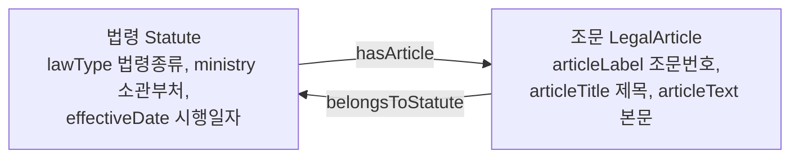

## 11. market — 공시 데이터 확장

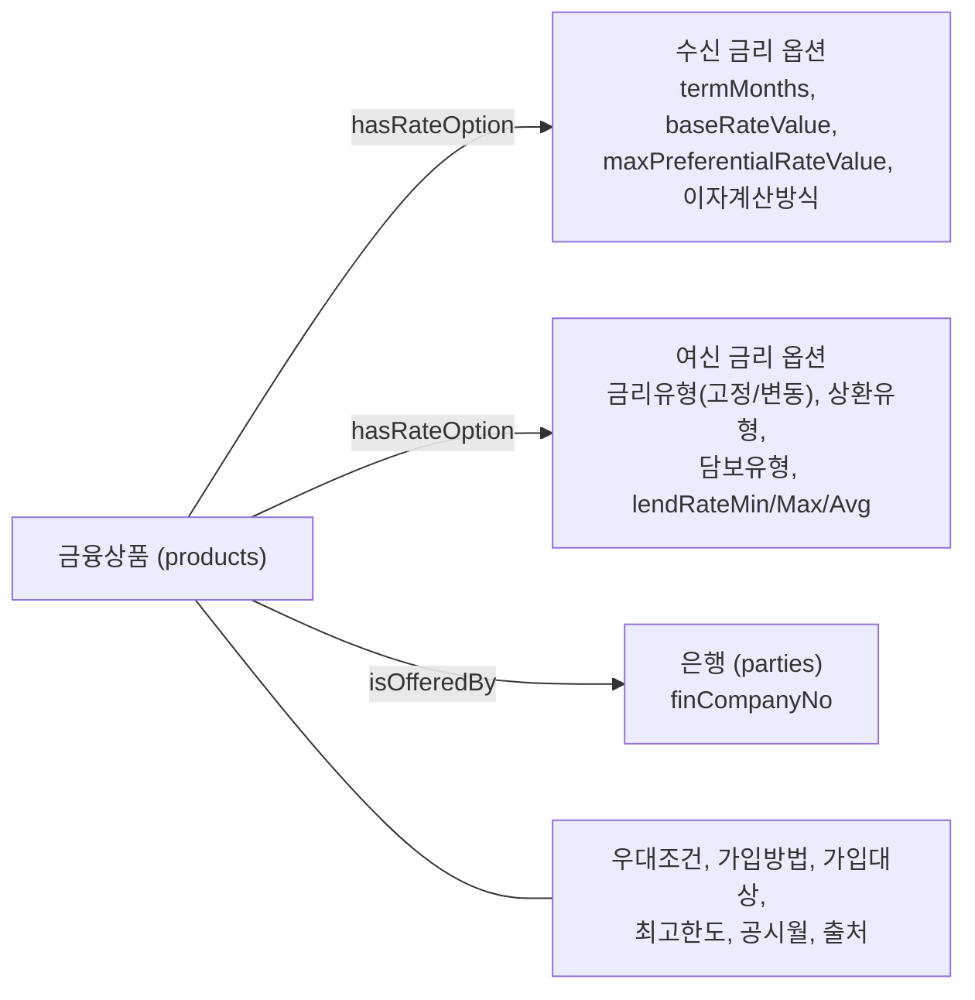

---

*이 다이어그램은 수동으로 관리된다. 스키마 변경 시 `scripts/validate.py` 통과 후
이 문서도 함께 갱신할 것. 전체 클래스·속성 목록은 KB의 `search_concepts` /
`get_hierarchy`로 조회 가능.*
